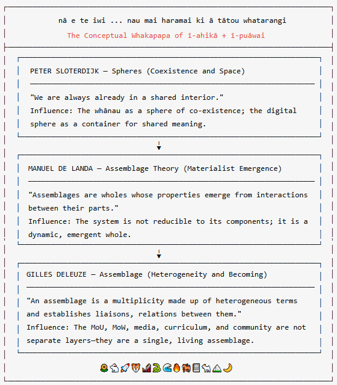
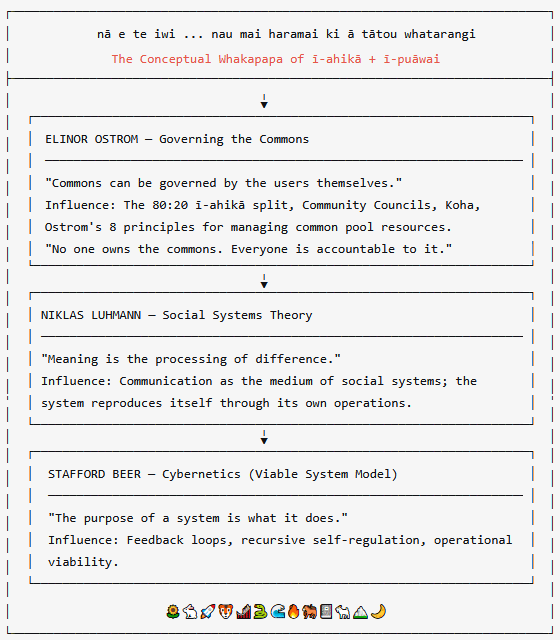

<!-- SECTION: COVER -->

# nā e mara mā manifesting #iuwe together

## an intergenerational chronicle of the forever blossoming of social learning assemblages

**#iuwe — Digital Mount Everest — No One Left Behind**

 

*"The rides are ready. The pathways are going in. The people are coming."*

---

  
   
  <em>nā e te iwi ... nau mai haramai ki ā tātou whatarangi ...</em>

  
   
  <em>nā e te iwi ... nau mai haramai ki ā tātou whatarangi ...</em>

---

## The Philosophical Lineage

ī-puāwai is not just a technical system. It is a **philosophical architecture**—a lived response to the question of how knowledge, community, and media can co-evolve without central control.

My work is informed by a lineage that runs from mid-century cybernetics through to contemporary materialist philosophy. While my daughter's generation navigates the world through the lenses of **Žižek** and **Fisher**, my own toolkit is shaped by **Sloterdijk, Deleuze, de Landa, Ostrom, Luhmann, Beer et al**.

**This is not a theoretical indulgence. It is the operating system of the platform.**

---

## i te tīmatanga ka te rongo

> *"e-mara-mā friendship is the seed. iuwe is the garden. and manifesting is the act of bringing it into being, right now, together."*

**#iuwe ∈ #6_billion_global_lifelong_learners** aka #social_learning_assemblages**

🌻🐇🚀🐯🎢🐍🌊🔥🐎📓🐐🏔️🌙❤️

