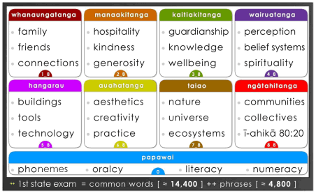

# 03 — senses and concept domains

**Status: approved provisional 25-domain register, faculty-space references, Papawai foundation references, and schema-v6 relationship capacity are in place; the first sealed 20-card Task A source-evidence package is under provisional human review; controlled local word-sense, crosswalk, and relationship work remains under review.**

A word is not enough to identify a learning object. `bat` may refer to a flying animal, a cricket implement, or a baseball implement. Ī-puāwai therefore separates a canonical word from its language-specific word senses, and only later connects a reviewed sense to appropriate learner statements, translations, visual or audio assets, and learning uses.

The public [provisional sense-domain register](provisional-sense-domain-register.md) records 25 changeable organising territories, eight named faculty spaces, and the separate Papawai foundation structure—**Phonemes, Oracy, Literacy, and Numeracy**—as reference dimensions for a **healthy living social learning system**. The register makes no individual word, translation, image, curriculum sequence, or carousel claim. Faculty-to-domain and foundation-to-domain crosswalks remain later reviewed relationship work, as do the designed-next reusable learning-statement records.

Stage 15 has produced a small sealed source-evidence package for twenty declared image candidates. That package preserves exact WordSet candidate entries and documentation-bundle fingerprints without declaring any card’s local word sense, visual relationship, faculty/domain placement, Papawai relationship, or curriculum use. The next gate is provisional human meaning-evidence assessment; separate Task B work is required before any local word-sense proposal can be considered.

The operating hierarchy is:

```text
faculty space → sense domain → referent concept → language-specific word sense
    → learner statement → reviewed visual/audio asset → practice event
```

Faculty spaces remain broad social-learning contexts. Sense domains provide the practical middle layer for organising review. Papawai and its child layers are separate language-and-learning reference dimensions. A source category records historical evidence; a sense domain organises a reviewable territory; a referent concept holds intended meaning; and a word sense gives that meaning a language-specific learning identity.



> **Illustrated working reference only.** The board makes the faculty and Papawai structure easier to read; it does not approve a faculty/domain crosswalk, a foundation/domain crosswalk, word membership, an image relationship, or a learning statement.

## Quality rule

> **Close is acceptable; wrong is not.**

A simple image may support a broad early-learning phrase, provided the phrase remains truthful to the visible referent. A visually impossible classification is not an inventive teaching opportunity; it is a reviewable mismatch.

Image availability must never decide curriculum membership. A legacy SVG, a local image collection, or an available emoji can support later workflow testing, but none is a domain authority or an approved learning relationship.
