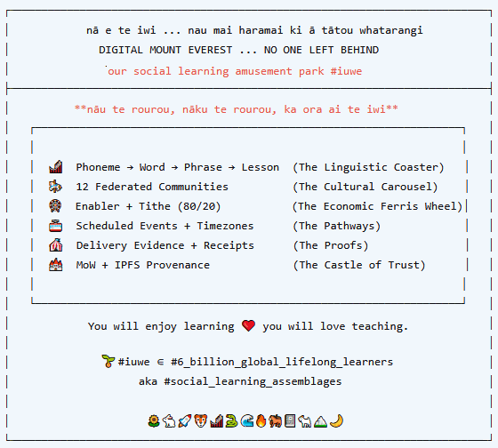

<!-- SECTION: COVER -->

# nā e mara mā manifesting #iuwe together

## an intergenerational chronicle of the forever blossoming of social learning assemblages

**#iuwe — Digital Mount Everest — No One Left Behind**

 

*"The rides are ready. The pathways are going in. The people are coming."*

---

  
   
  <em>nā e te iwi ... nau mai haramai ki ā tātou whatarangi ...</em>

---

## Table of Contents — Our Manifest

| Chapter | Our Manifestations |
|---------|-------------------|
| [01. Our Seed-Banks](./01-our-seed-banks/) | Where a mothers tongue begins — phonemes, syllables, the sounds of origin |
| [02. Our Community Gardens](./02-our-community-gardens/) | 12 communities, each planting in their own time |
| [03. Our Rides](./03-our-rides/) | The learning itself — content, derivatives, provenance |
| [04. Our Pathways](./04-our-pathways/) | How it reaches the people — scheduling, timezones, delivery |
| [05. Our Tickets](./05-our-tickets/) | Enablers, the tithe, ī-ahikā 80/20 — the economics of care |
| [06. Our Proofs](./06-our-proofs/) | Evidence, receipts, verification — trust, not accounting |
| [07. Our Roots](./07-our-roots/) | The shoulders we stand on — tupuna, whakapapa, critical thinkers |
| [Schematics](./schematics/) | Maps of the garden, in pictures |

---

## The View from the Manifest

> *"We are not building a platform. We are manifesting an intergenerational garden - one where the rides are shared, the schedule is sovereign, and the enabler pays for outcomes, not just airtime."*

---

## i te tīmatanga ka te rongo

> *"e-mara-mā friendship is the seed. iuwe is the garden. and manifesting is the act of bringing it into being, right now, together."*

**#iuwe ∈ #6_billion_global_lifelong_learners** aka #social_learning_assemblages**

🌻🐇🚀🐯🎢🐍🌊🔥🐎📓🐐🏔️🌙❤️

